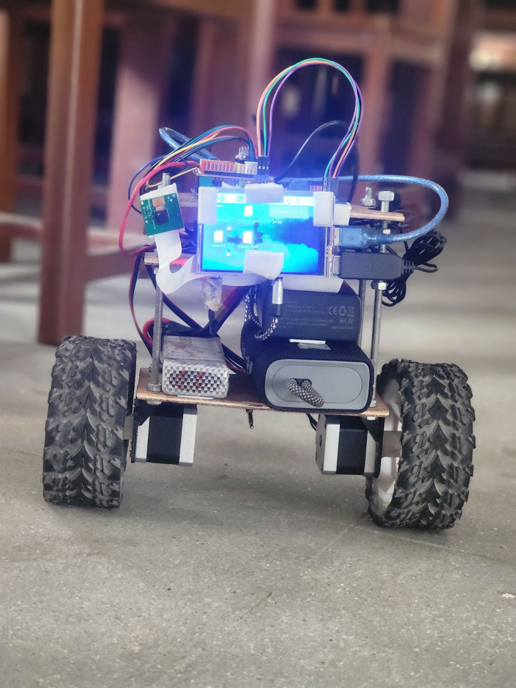

# Smart Self-Balancing Robot

A self-balancing robot based on the inverted pendulum model, combining real-time sensor feedback, computer vision, and voice-assisted interaction.

## Overview

This project uses sensor data and control algorithms to maintain balance on two wheels. A Raspberry Pi handles computer vision and intelligent features, while an Arduino manages real-time control of the balancing system.

## Features

* Self-balancing using sensor feedback
* Inverted pendulum control system
* Real-time motor control
* Computer vision using OpenCV
* Voice-enabled smart assistant
* Integration between Arduino and Raspberry Pi

## Hardware

* Arduino Uno
* Raspberry Pi 4
* MPU6050 IMU
* Nema-17 Stepper Motors
* DRV8825 Motor Drivers
* 3300mAh LiPo Battery

## Software

* Python
* Embedded C
* OpenCV
* Gemini API

## System Flow

MPU6050 Sensors -> Arduino Control System -> Motor Drivers -> Stepper Motors

[▶ Balancing Demo](https://youtube.com/shorts/tE44lUxIx_E)
[▶ Assistant Demo](https://youtube.com/shorts/kOs3wUx_cmk?feature=share)
